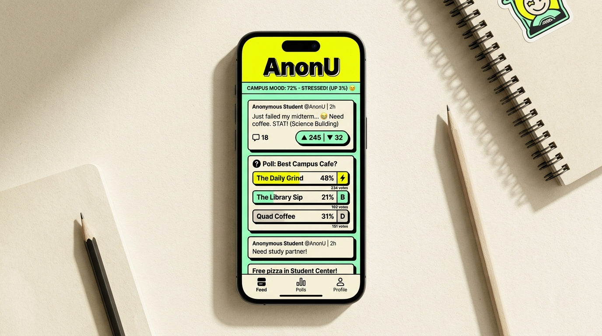

# AnonU 🎭

> **The uncensored, zero-dox campus microblog for students.**  
> Post anonymously when you need to rant about midterms. Post under your real name when you're hosting an event. No fake clout, no algorithm manipulation, just real campus pulse.

<br/>

<p align="center">
  
</p>

<p align="center">
  
  
  
  
</p>

---

## Why I Built This

Most campus social apps are either completely ruined by ads or turn into toxic cesspools because there’s no accountability. 

AnonU is built around a simple premise: **you control your identity on every single post.**

- Need to vent about a terrible dorm situation or ask an embarrassing freshman question? Flip on your **Anonymous Mask** (`Cyan Kestrel`, `Solar Badger`, etc.). Your real identity is never exposed to other students.
- Selling football tickets, looking for a roommate, or running a club hackathon? Flip on your **Verified Profile** so people can reach out to you directly.

The entire UI is built with a **Neo-Brutalist** aesthetic — thick black outlines, hard offset shadows, high-contrast typography, and tactile spring feedback on every tap.

---

## What's Packed Inside

### 🎭 Smart Pseudonym Engine
Every anonymous post gets assigned a deterministic animal pseudonym and its own signature pop color stamp. The backend links the post to your UID for spam/abuse moderation, but clients only ever see the mask.

### ⏳ Self-Destructing Posts (TTL)
Not every rant needs to live on the internet forever. Set your post to expire in **1h, 6h, 12h, 24h, 48h, or Never**. Expired posts disappear from the feeds automatically.

### 📊 Live Polls & Image Galleries
- Attach live polls with animated vote progress meters and letter stamps (`[A]`, `[B]`, `[C]`, `[D]`).
- Attach up to 4 high-res photos with a built-in full-screen zoomable viewer.

### 💬 Thread Tree (Recursive Nested Comments)
Real conversation threading with visual branch lines so you can actually follow multi-level reply debates without losing track of who is talking to who.

### 🔥 Campus Mood Board & Streaks
Check in once a day with how you're feeling (`🔥 Hyped`, `😊 Good`, `😐 Meh`, `😓 Stressed`, `😞 Low`, `😴 Tired`). Your vote joins the aggregate campus vibe chart, and you keep your daily flame streak alive.

### 🛡️ Built-in Moderator Queue
If someone posts doxxing info, harassment, or spam, students can report it with 1 tap. Users with the `isModerator` flag get an incident review panel to inspect reasons and either dismiss reports or instantly hide the post.

---

## Project Structure

```text
lib/
├── core/
│   ├── constants/       # Mood configs, TTL options, campus topics
│   ├── theme/           # Neo-Brutalist design tokens (shadows, borders, palette)
│   ├── utils/           # GoRouter & App navigation shell
│   └── widgets/         # BrutalistCard, BrutalistButton, BrutalistBadge, etc.
├── features/
│   ├── auth/            # Sign in, Sign up & live pseudonym generator
│   ├── feed/            # Hot / New / Top segmented feeds & post cards
│   ├── mood/            # Campus mood ticker & daily check-in sheet
│   ├── notifications/   # Unread alerts for votes, comments & reposts
│   ├── post/            # Post composer & nested comments thread tree
│   ├── profile/         # Identity switcher, streak stats & moderator queue
│   └── search/          # Real-time tag explorer & query filter
└── shared/              # Reusable models, services (Auth, Posts, Pseudonyms)
```

---

## Running Locally

### 1. Clone & install packages
```bash
git clone https://github.com/Amirtheshwaran/anonu-remake.git
cd anonu-remake
flutter pub get
```

### 2. Configure Firebase
Make sure you have the FlutterFire CLI installed:
```bash
dart pub global activate flutterfire_cli
flutterfire configure
```
This generates your `lib/firebase_options.dart` connected to your Firebase project.

### 3. Deploy Security Rules
```bash
firebase deploy --only firestore:rules,storage
```

### 4. Launch the App
```bash
# Run on Chrome
flutter run -d chrome

# Or run on iOS / Android / Desktop
flutter run
```

---

## Database Architecture

```text
/users/{uid}                           # Profile, streaks, permanent pseudonym
/posts/{postId}                        # Post body, media, poll data, TTL expiry
/posts/{postId}/votes/{uid}            # Individual vote records (prevents double-voting)
/posts/{postId}/comments/{commentId}   # Nested comment tree with parentCommentId
/posts/{postId}/pollVotes/{uid}        # Single-vote poll verification
/moodBoard/{entryId}                   # Anonymous daily mood check-ins
/notifications/{notifId}               # In-app activity alerts
/reports/{reportId}                    # Moderator queue incident reports
```

Security rules strictly enforce that:
1. Public users cannot read the private voter subcollection or expose who upvoted what.
2. Only designated moderators can access the reports collection and toggle `isHidden` on reported posts.
3. Mood board entries store only the mood emoji and timestamp, with no readable user ID attached.

---

## License

MIT License. Feel free to fork, tweak, and run this for your own university campus.
